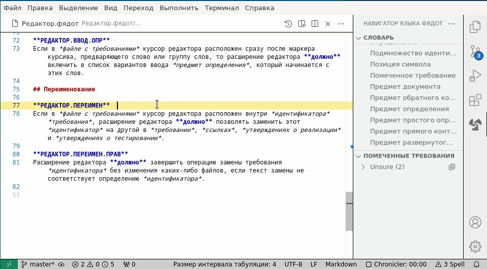
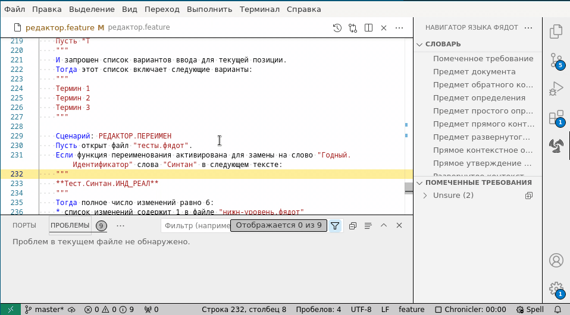
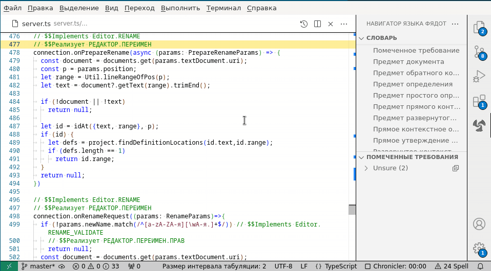
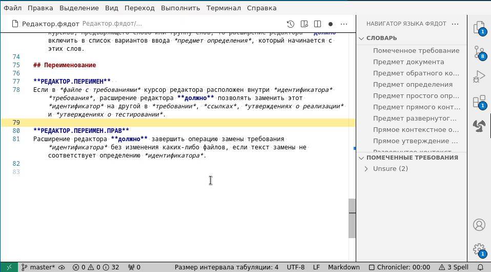

# Shalldn language server

Shalldn - это формальный язык для создания требований. Расширение Shalldn language server предоставляет функциональные возможности для создания проектов и управления ими на основе требований, написанных на Shalldn.

Расширение является частью [проекта Shalldn] (http://shalldn.net), который также включает спецификации для языка Shalldn. Работа над расширением и спецификациями языка продолжается.

Расширение поддерживает работу с требованиями, написанными на диалекте Shalldn для русского языка -- ФЯДОТ (Формальный Язык Для Описания Требований).

## Краткое введение в ФЯДОТ

Язык ФЯДОТ определяется набором ограничений для **русского** языка и как таковой является подмножеством естественного русского языка. Кроме того, ФЯДОТ использует правила пунктуации, основанные на языке разметки Markdown для придания специального значение фрагментам текста.

Для того чтобы расширение распознавало текст Markdown как документ ФЯДОТ, файл должен иметь расширение имени .фядот.

Формальное требование в ФЯДОТ - это утверждение из одного предложения, в котором предмет документа с требованиями является подлежащим, за которым следует заключенное в маркеры жирного шрифта слово **долж(-ен,-на,-но,-ны)**.  Ошибкой является выделение нескольких выделенных жирным шрифтом слов **должен** в одном предложении, или наличие слова **должен** после текста, который не является предметом документа.

Предмет документа - это заключенная в маркеры курсива группа слов в первой строке документа. Первая строка обычно представляет собой заголовок с маркером заголовка # в начале строки. Отсутствие в документе .фядот определения предмета документа является ошибкой.

Каждое требование должно иметь уникальный идентификатор, который может содержать буквенно-цифровые символы и точки. Идентификатор должен непосредственно предшествовать предложению с требованием и быть заключен в маркеры жирного шрифта. Наличие предложения с требованием без идентификатора или с неуникальным идентификатором является ошибкой.

Идентификаторы требований используются для связывания требований на разных уровнях проектирования, будь то требования более низкого уровня, реализующий код или тесты. В документах .фядот связь устанавливается с помощью *утверждения о реализации*: строкой списка с пульками, следующего сразу после требования, начинающейся со слова "Реализует", за которым следует один или несколько идентификаторов требований, разделенных запятыми, каждый заключен в маркеры жирного шрифта. В любом другом файле утверждение о реализации помещается в комментарии, начинающемся с ключевого слова '$$Реализует', за которым следует список идентификаторов требований через запятую.

Учитывая приведенное выше описание, вот пример документа на ФЯДОТ:

| Исходный текст с разметкой | Отображаемый текст |
|------|------|
|<код># *Пример документа ФЯДОТ*   `**Пример.Содержимое**`  Пример документа ФЯДОТ `**должен***` содержать хотя бы один фрагмент текста, иллюстрирующего правила языка. * Реализует `**ЗДРАВЫЙ_СМЫСЛ**`</code>|<H2>*Пример документа ФЯДОТ*</H2> **Пример.Содержимое**  Пример документа ФЯДОТ **должен** содержать хотя бы один фрагмент текста, иллюстрирующего правила языка. <ul><li>Реализует **ЗДРАВЫЙ_СМЫСЛ**</ul>|

## Функции расширения

Языковой сервер в настоящее время предоставляет следующие функции:

### Навигация 
Расширение позволяет переходит по ссылкам на идентификаторам требований. Щелкните по идентификатору при нажатой клавише **Ctrl**, чтобы открыть определение требования или перейти к ссылкам на требование от утверждений о реализации или от тестов дле этого требования. 

### Указание проблем
Расширение выделяет проблемы ФЯДОТ волнистыми линиями в тексте и перечисляет их в окне "Проблемы", аналогично ошибкам компиляции для языков программирования.

Проблемы в файлах .фядот включают нарушения синтаксиса языка и проблемы проекта, такие как отсутствие реализации требования. Для всех других типов файлов в проекте проблемы ограничены *утверждениями о реализации* или *утверждениями о тестировании*, содержащими идентификатор не связанный с требованием.

### Предложение вариантов ввода
Расширение предлагает варианты окончаний для введенного текста, такие как ключевые слова и идентификаторы требований, в файлах с требованиями .фядот, и в других файлах проекта.

### Переименование
Расширение позволяет переименовывать идентификаторы требований в определениях и всех ссылках.

### Пометки
Расширение поддерживает пометку индивидуальных требований для различных целей, таких как статус или отслеживание запросов на изменения. Окно навигатора обеспечивает быстрый доступ к помеченным требованиям.

### Отчет о покрытии

Нажмите клавишу F1 и начните вводить "ФЯДОТ" в поле ввода команды, затем выберите команду "Создать отчет о покрытии". Ниже приведен пример отчета, созданного на основе требований проекта Shalldn. Обратите внимание, что отчет является интерактивным и позволяет углубляться в подмножества идентификаторов, нажимая на треугольный значок.

		<h1>Отчет о покрытии требований</h1>
		<h3>Рабочая пространство: shalldn (master)</h3>
		<h6>Создано  10/20/2024, 3:41:00 PM</h6>
	

<b>Analyzer</b>: 100% Реализовано (20/20, 1.4 на одно требование в среднем)  35% Оттестировано (7/20, 2.4 на одно требование в среднем)
<ul><li><b>Analyzer.ERR</b>: 100% Реализовано (4/4, 1.5 на одно требование в среднем)  50% Оттестировано (2/4, 1.5 на одно требование в среднем) </li><li><b>Analyzer.TEST</b>: 100% Реализовано (4/4, 1.3 на одно требование в среднем)  100% Оттестировано (4/4, 3 на одно требование в среднем) </li></ul>

<b>Editor</b>: 91.7% Реализовано (22/24, 1.4 на одно требование в среднем)  25% Оттестировано (6/24, 2.2 на одно требование в среднем)
<ul><li><b>Editor.CMPL</b>: 100% Реализовано (8/8, 1.3 на одно требование в среднем)  25% Оттестировано (2/8, 2 на одно требование в среднем) </li><li><b>Editor.ERR</b>: 100% Реализовано (3/3, 1.7 на одно требование в среднем)  33.3% Оттестировано (1/3, 1 на одно требование в среднем) </li><li><b>Editor.INFO</b>: 100% Реализовано (2/2, 1 на одно требование в среднем)  100% Оттестировано (2/2, 3 на одно требование в среднем) </li><li><b>Editor.NAV</b>: 100% Реализовано (5/5, 1.2 на одно требование в среднем)  0% Оттестировано (0/5) </li></ul>

<b>Parser</b>: 100% Реализовано (24/24, 1.3 на одно требование в среднем)  25% Оттестировано (6/24, 1.7 на одно требование в среднем)
<ul><li><b>Parser.ERR</b>: 100% Реализовано (9/9, 1.2 на одно требование в среднем)  22.2% Оттестировано (2/9, 2.5 на одно требование в среднем) </li><li><b>Parser.IMPLMNT</b>: 100% Реализовано (3/3, 1.3 на одно требование в среднем)  66.7% Оттестировано (2/3, 1 на одно требование в среднем) </li></ul>

<b>РЕДАКТОР</b>: 100% Реализовано (22/22, 1.3 на одно требование в среднем)  27.3% Оттестировано (6/22, 1.8 на одно требование в среднем)
<ul><li>

<b>РЕДАКТОР.ВВОД</b>: 100% Реализовано (8/8, 1.3 на одно требование в среднем)  25% Оттестировано (2/8, 2 на одно требование в среднем)
<ul><li><b>РЕДАКТОР.ВВОД.РЕАЛ</b>: 100% Реализовано (3/3, 1 на одно требование в среднем)  0% Оттестировано (0/3) </li></ul>
</li><li><b>РЕДАКТОР.ИНФО</b>: 100% Реализовано (2/2, 1 на одно требование в среднем)  100% Оттестировано (2/2, 2 на одно требование в среднем) </li><li><b>РЕДАКТОР.НАВ</b>: 100% Реализовано (5/5, 1.2 на одно требование в среднем)  0% Оттестировано (0/5) </li><li><b>РЕДАКТОР.ОШИБКА</b>: 100% Реализовано (3/3, 1 на одно требование в среднем)  33.3% Оттестировано (1/3, 1 на одно требование в среднем) </li><li><b>РЕДАКТОР.ПЕРЕИМЕН</b>: 100% Реализовано (2/2, 1.5 на одно требование в среднем)  0% Оттестировано (0/2) </li></ul>

<b>СИНТАН</b>: 100% Реализовано (24/24, 1.3 на одно требование в среднем)  25% Оттестировано (6/24, 1.5 на одно требование в среднем)
<ul><li>

<b>СИНТАН.ОПР</b>: 100% Реализовано (4/4, 1 на одно требование в среднем)  25% Оттестировано (1/4, 2 на одно требование в среднем)
<ul><li><b>СИНТАН.ОПР.КНТ</b>: 100% Реализовано (3/3, 1 на одно требование в среднем)  0% Оттестировано (0/3) </li></ul>
</li><li><b>СИНТАН.ОШИБКА</b>: 100% Реализовано (9/9, 1.2 на одно требование в среднем)  22.2% Оттестировано (2/9, 2 на одно требование в среднем) </li><li><b>СИНТАН.РЕАЛЕЗАЦИЯ</b>: 100% Реализовано (2/2, 1 на одно требование в среднем)  100% Оттестировано (2/2, 1 на одно требование в среднем) </li></ul>

<b>СТРУКТАН</b>: 100% Реализовано (20/20, 1.2 на одно требование в среднем)  30% Оттестировано (6/20, 2.7 на одно требование в среднем)
<ul><li><b>СТРУКТАН.ИНФО</b>: 100% Реализовано (2/2, 1 на одно требование в среднем)  0% Оттестировано (0/2) </li><li><b>СТРУКТАН.ОПРЕДЕЛЕНИЯ</b>: 100% Реализовано (2/2, 1 на одно требование в среднем)  0% Оттестировано (0/2) </li><li><b>СТРУКТАН.ОШИБКА</b>: 100% Реализовано (4/4, 1.5 на одно требование в среднем)  25% Оттестировано (1/4, 2 на одно требование в среднем) </li><li><b>СТРУКТАН.РЕАЛ</b>: 100% Реализовано (2/2, 1 на одно требование в среднем)  50% Оттестировано (1/2, 2 на одно требование в среднем) </li><li><b>СТРУКТАН.ТЕСТ</b>: 100% Реализовано (4/4, 1.3 на одно требование в среднем)  100% Оттестировано (4/4, 3 на одно требование в среднем) </li></ul>

<b>Требования без домена</b>: 100% Реализовано (6/6, 1 на одно требование в среднем)  0% Оттестировано (0/6)
<ul><li><b>shalldn.shalldn</b>: 100% Реализовано (3/3, 1 на одно требование в среднем)  0% Оттестировано (0/3) </li><li><b>ru/ФЯДОТ.фядот</b>: 100% Реализовано (3/3, 1 на одно требование в среднем)  0% Оттестировано (0/3) </li></ul>

## Полный пример
Чтобы протестировать все доступные функции расширения, вы можете загрузить [исходный код проекта Shalldn с GitHub](https://github.com/vldmr-bus/shalldn), который содержит набор спецификаций Shalldn, демонстрирующих связность от требований высокого уровня вплоть до исходного кода расширения и тестов.

## Список команд, доступных через палитру команд

Нажмите клавишу F1, чтобы открыть палитру команд. Начните вводить слово ФЯДОТ, чтобы отфильтровать доступные команды.

### Создать отчет о покрытии.

Сгенерировать HTML-файл с отчетом о покрытии для текущего проекта (см. [пример](#Отчет о покрытии)).

### Экспортировать проект в виде коллекции файлов HTML.

Создать коллекцию статических HTML-файлов, отображающих форматирование разметки Markdown, и содержащих перекрестные ссылки на требования в проекте. Такая форма представления проекта может быть полезна, когда нужно предоставить требования заказчику для ознакомления.

### Переключение отображения ошибок как предупреждений.

Позволяет понизить уровень ошибок ФЯДОТ до предупреждений, поскольку наличие ошибок может помешать запуску проекта для отладки на некоторых языках.

## Переключение предупреждений о требованиях без тестов в этом файле.

Обычно требования без тестов не отмечаются как проблемы. Эта команда позволяет пометить такие требования в активном файле.

